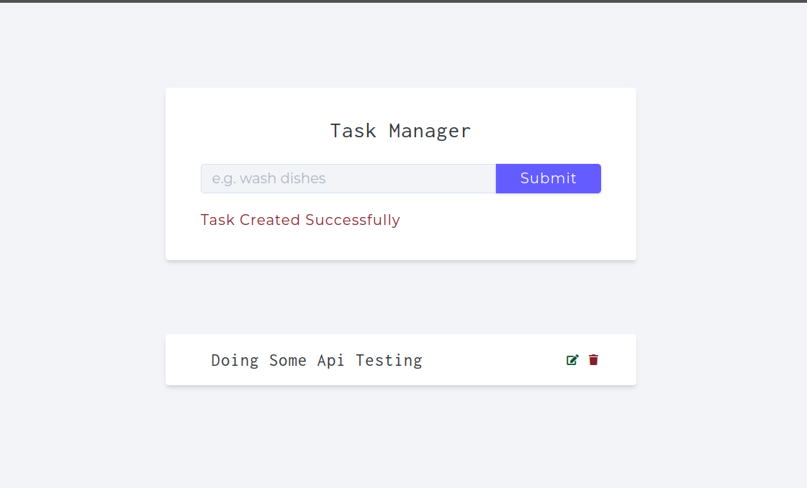
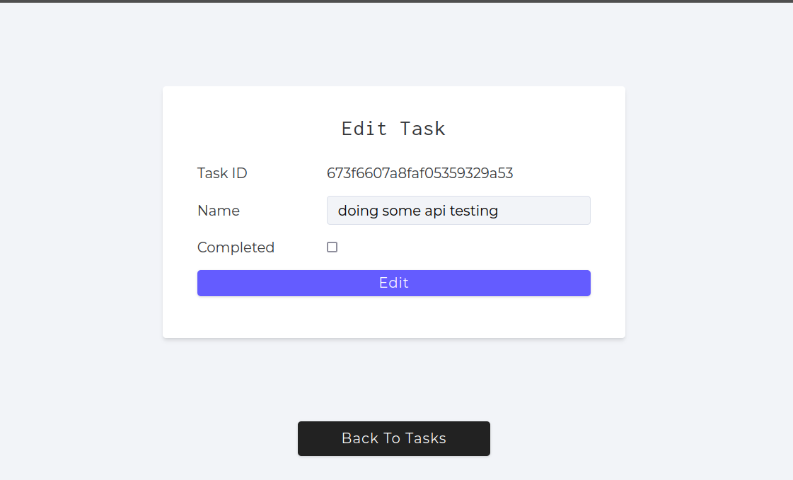

# Zakk Task Mnger

> Simple Task Manger api that show my skills in nodejs and mongodb

## Features

- Create task
- Read Tasks
- Update Task
- Delete Task
- creating account and login

##
can you help me to fin internship?

